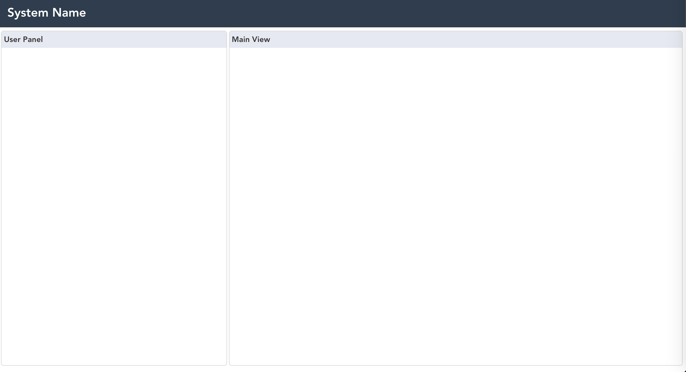

This is the template repo for vuejs and flask project

1. set up frontend
```
cd frontend
npm install
npm run serve
```

2. set up backend
```
cd backend
python run-data-backend.py
```

Environment:
- vue@2.6.12
- d3v5
- python 3.7 or above

System screenshot:

